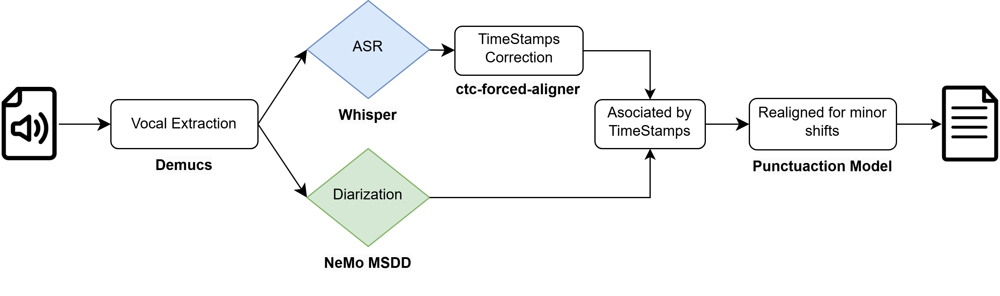

# Automatic Interviews Processing: From Transcriptions to Insights

This repository provides a scalable and automated pipeline for transcription and diarization of audio interviews, tailored to handle real-world challenges such as noisy recordings, overlapping speakers, and multi-language scenarios. It leverages open-source tools, including **Whisper** and **NeMo MSDD**, to deliver accurate transcription and speaker diarization outputs in text and CSV format. Everything runs locally and for free.

On top of the transcription CLI, the repository contains the evaluation, text analysis and topic modeling work done on the resulting transcripts.

Developed by [David Friou](https://github.com/AfroDeivid) as part of a semester project at [LNCO Lab](https://www.epfl.ch/labs/lnco/).

> **Note:** The standalone CLI previously published as [lnco-transcribe](https://github.com/AfroDeivid/lnco-transcribe) has been merged into this repository and is no longer maintained separately. The original semester-project version (conda environment, frozen requirements) is preserved under the tag [`v1.0-semester-project`](https://github.com/AfroDeivid/automatic-interviews-processing/tree/v1.0-semester-project).



## Table of Contents
1. [Installation](#installation)
   1. [Prerequisites](#1-prerequisites)
   2. [Installing the Project](#2-installing-the-project)
2. [Usage](#usage)
   1. [Preparing Your Data](#preparing-your-data)
   2. [Transcription & Diarization (Audio-to-Text)](#transcription--diarization-audio-to-text)
   3. [Outputs](#outputs)
3. [File Structure](#file-structure)
   1. [Audio-to-Text Processing](#audio-to-text-processing)
   2. [Transcript Evaluation](#transcript-evaluation)
   3. [Text and Topic Analysis](#text-and-topic-analysis)
4. [Development](#development)
5. [Mentions](#mentions)

## Features

- **End-to-End Pipeline:** From raw audio (multiple formats) to cleaned, diarized transcripts in `.txt` and `.csv`.
- **Command-Line Tool:** A single `interviews-transcribe` command processes whole folders of interviews.
- **Multi-Language Support:** Enabling automatic language detection or user-defined translation tasks.
- **Scalable Processing:** Processes nested folder structures, allowing large numbers of audio files spread across multiple experiments. Already transcribed files are skipped, and every run is logged.
- **Post-Processing:** Text cleaning, removal of fillers, and prediction of speaker roles (e.g., interviewer vs. participant) to prepare transcripts for analysis.
- **Analysis & Topic Modeling:** Notebooks for detailed **text** analysis, including word count, keyword extraction, and topic modeling to uncover themes and patterns within the transcripts.

# Installation

## 1. Prerequisites

- Install ``FFMPEG`` from [here](https://ffmpeg.org/download.html), you can follow a guide like [this](https://phoenixnap.com/kb/ffmpeg-windows) for Windows installation.
Ensure that FFMPEG is added to your system’s PATH.

- Install [uv](https://docs.astral.sh/uv/getting-started/installation/), which manages Python and all dependencies (no conda needed).

- *Windows, only if you hit build errors during installation:* install [Strawberry Perl](https://strawberryperl.com/) and the [Visual C++ Build Tools](https://visualstudio.microsoft.com/visual-cpp-build-tools/).

## 2. Installing the Project

From the repository folder:

```bash
# Transcription only
uv sync

# Transcription + evaluation, text analysis and topic modeling notebooks
uv sync --extra analysis
```

uv creates a `.venv/` folder with the right Python version and the exact package versions from `uv.lock`. Prefix commands with `uv run` to use it (or activate `.venv`).

<details>
<summary>Without uv (pip)</summary>

Some dependencies are installed from git repositories, which pip only resolves through the requirements file:

```bash
python -m venv .venv
# Windows: .venv\Scripts\activate    Linux/macOS: source .venv/bin/activate
pip install cython
pip install -c constraints.txt -r requirements.txt
pip install --no-deps -e .

# Optional, for the analysis notebooks
pip install matplotlib seaborn plotly wordcloud networkx beautifulsoup4 spacy bertopic nbformat streamlit
python -m spacy download en_core_web_sm
```
</details>

# Usage

## Preparing Your Data

The pipeline supports nested folder structures, making it easy to process multiple experiments and interviews. To use the pipeline:

- Simply indicate the path to your folder with your audio files.
- The pipeline recursively processes all audio files within these folder and subfolders.
- The name of the folder you give is used as the experiment name in the outputs.

## Transcription & Diarization (Audio-to-Text)

- **Transcribe audio in its original language :** *(specified with --language)*
```bash
uv run interviews-transcribe -d path_to_folder --whisper-model large-v3 --language en
```

- **Transcribe and translate audio to english :** *(e.g. from french to english)*
```bash
uv run interviews-transcribe -d path_to_folder --whisper-model large-v3 --language fr --task translate
```
- Optionally add ``--also-transcribe`` to also save a transcript in the original language alongside the translated one. Outputs will be saved to:
  - ``results/<experiment>/<subfolders...>`` for original transcription
  - ``results/<experiment>/fr_to_eng/<subfolders...>`` for translated version

If only ``language`` is specified, the model will attempt to translate any detected language into the specified language.

To improve performance, specify the task as ``translate`` if you know in advance that the audio is in a certain language (e.g., French) and want to translate it into English.

- You can view the list of all supported languages along with their corresponding language codes here: [Languages](interviews_processing/whisper_diarization/helpers.py)

| Parameter         | Description                                         | Default                         |
|-------------------|-----------------------------------------------------|---------------------------------|
| **`-d, --directory`** | Path to the directory containing audio files.       | *required*                 |
| **`--whisper-model`** | Name of the Whisper model used for transcription (`tiny`, `base`, `small`, `medium`, `large-v3`, ...).   | `large-v3`                      |
| **`--language`**       | Language code (e.g., `en`, `fr`) or name (e.g., `english`). | `en`                            |
| **`--task`**           | `transcribe` or `translate` (to English).  | `transcribe`                            |
| **`--also-transcribe`**           | When using ``--task translate``, also transcribes the audio in the original language.  | False                            |
| **`-e, --extensions`**      | List of allowed audio file extensions.              | `.m4a .mp4 .wav`        |
| **`--overwrite`**       | Overwrites existing transcriptions if specified.    | False                           |

*Run ``uv run interviews-transcribe --help`` for all options, or see [run_diarize.py](interviews_processing/run_diarize.py).*

Each run appends one row per file (start time, status, duration or error) to `processing_log.csv` in the current folder.

## Outputs
The tool generates transcripts in two structured formats, under `results/<experiment>/`:

- **Text Format:** Simplified and easy-to-read files for manual review.
- **CSV Format:** A structured format ideal for analysis, with columns such as:
  - Experiment name (derived from the name of the folder directory).
  - File name.
  - Participant ID.
  - Timestamps for each segment.
  - Speaker and transcription content.

### Processed folder
`results/processed/` contains the same outputs after additional preprocessing steps:

- Removal of vocalized fillers
- Visual cleaning of the text
- Prediction of the speaker role in interview set-up (Participant & Interviewer)

For a more modular approach you can use the [preprocessing notebook](notebooks/preprocessing.ipynb).

# File Structure

## Audio-to-Text Processing
This section focuses on converting raw audio data into text through transcription and diarization, enabling subsequent analysis.

- **Preprocessing and Conversion:**
  - [notebooks/pre_analysis.ipynb](notebooks/pre_analysis.ipynb): Analyzes audio files and experiment structure.
  - [videos_to_audio.py](interviews_processing/videos_to_audio.py): Converts video formats (`.MTS`, `.mp4`, ...) into `.wav` for processing.
    Run via `uv run python -m interviews_processing.videos_to_audio --raw_root_dir path_to_folder`.

- **Transcription & Diarization:**
  - [run_diarize.py](interviews_processing/run_diarize.py): The `interviews-transcribe` command, batch-processing transcription and speaker diarization.
  - [whisper_diarization/](interviews_processing/whisper_diarization/): Source code adapted from the Whisper-Diarization framework (see [Mentions](#mentions)), including the NeMo MSDD configuration.

- **Transcript Preprocessing:**
  - [notebooks/preprocessing.ipynb](notebooks/preprocessing.ipynb): Modular workflow for cleaning and preparing transcripts for further analysis.

``interviews_processing/utils/`` [format_helpers.py](interviews_processing/utils/format_helpers.py) and [preprocessing_helpers.py](interviews_processing/utils/preprocessing_helpers.py): Assist with structured formatting and transcript preprocessing.

[scripts/](scripts/): Small file-management utilities used for a specific dataset (moving transcribed files, replacing already processed audio by placeholders to free storage). Adapt the paths before use.

## Transcript Evaluation
This section focuses on validating transcription quality and ensuring the accuracy of the processed data. *(requires `uv sync --extra analysis`)*

- [notebooks/evaluation.ipynb](notebooks/evaluation.ipynb): Assesses transcription (WER) and diarization (DER) accuracy against manually verified transcripts.

``interviews_processing/utils/`` [evaluation_helpers.py](interviews_processing/utils/evaluation_helpers.py) and [text_html.py](interviews_processing/utils/text_html.py): Functions for transcription/diarization performance evaluations and HTML visual comparisons.

## Text and Topic Analysis
This section delves into analyzing text for patterns and extracting thematic insights through topic modeling. *(requires `uv sync --extra analysis`)*

- **Text Analysis:**
  - [notebooks/analysis_text.ipynb](notebooks/analysis_text.ipynb): Explores transcript content, including distributions (e.g., conditions, interviewers), word count, and keywords.

- **Automated Topic Modeling:**
  - [notebooks/bert_topic.ipynb](notebooks/bert_topic.ipynb): Performs topic modeling (BERTopic) to identify themes within the transcripts.

- **Topic Analysis & Visualization:**
  - [notebooks/analysis_topics.ipynb](notebooks/analysis_topics.ipynb): Provides high-level overviews and detailed analyses of identified topics.
  - [notebooks/topic_overview.py](notebooks/topic_overview.py): A Streamlit app for interactively exploring specific topics.
    - Run via `uv run streamlit run notebooks/topic_overview.py`.

``interviews_processing/utils/`` [analysis_helpers.py](interviews_processing/utils/analysis_helpers.py): Shared utility functions for text and topic analyses.

To open the notebooks, select the `.venv` interpreter in VS Code, or run `uv run --with jupyter jupyter lab`.

# Development

```bash
uv sync --extra analysis   # dev dependencies (pytest) are included by default
uv run pytest              # fast unit tests (no models needed)
```

The end-to-end test runs the real models on a short recording and is skipped by default:

```bash
# Linux/macOS
AIP_TEST_AUDIO=path/to/short_clip.wav uv run pytest -m slow
# Windows PowerShell
$env:AIP_TEST_AUDIO="path\to\short_clip.wav"; uv run pytest -m slow
```

# Mentions

This work relies heavily on the **Whisper-Diarization** framework to handle transcription and diarization of audio files into structured text formats, which is licensed under the BSD 2-Clause License.

```bibtex
@unpublished{hassouna2024whisperdiarization,
  title={Whisper Diarization: Speaker Diarization Using OpenAI Whisper},
  author={Ashraf, Mahmoud},
  year={2024}}
```
For additional details, visit the [Whisper-Diarization GitHub repository](https://github.com/MahmoudAshraf97/whisper-diarization). The adapted code and the list of local changes are documented in [UPSTREAM.md](interviews_processing/whisper_diarization/UPSTREAM.md).

The pipeline also installs the following projects directly from GitHub, pinned to exact commits in `pyproject.toml`:
[demucs](https://github.com/MahmoudAshraf97/demucs) (vocal separation, fork of [facebookresearch/demucs](https://github.com/facebookresearch/demucs)),
[ctc-forced-aligner](https://github.com/MahmoudAshraf97/ctc-forced-aligner) (word timestamps),
[deepmultilingualpunctuation](https://github.com/oliverguhr/deepmultilingualpunctuation) (punctuation restoration) and
[indic-numtowords](https://github.com/AI4Bharat/indic-numtowords).
